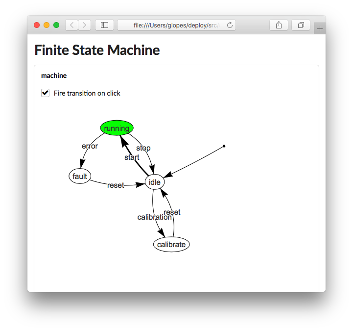
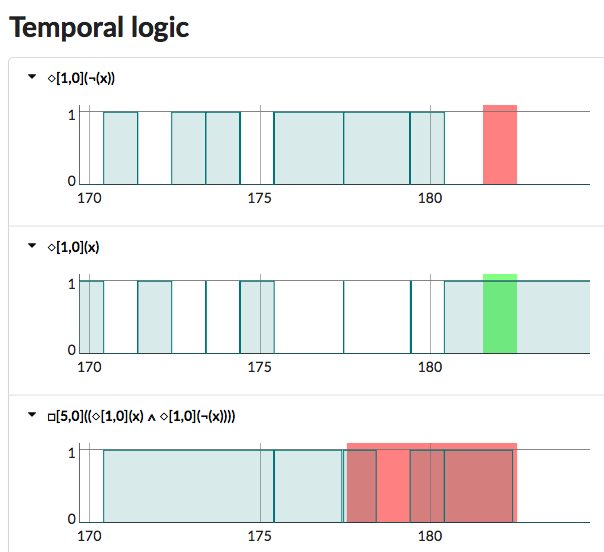

[](https://pypi.python.org/pypi/RoboticsLanguage/) [](https://github.com/robotcaresystems/RoboticsLanguage/blob/master/LICENSE) [](https://pypi.python.org/pypi/RoboticsLanguage/) 
<!--  -->


## News

 - We presented a tutorial at [IEEE IRC 2019](http://irc.asia.edu.tw/2019/). [Slides are available here](Documentation/Tutorials/IEEE-IRC-2019/README.md).
 - We presented recently at the [AWS re:invent conference 2018](https://youtu.be/HAela66zov0?t=1692)

# What is the language of Robotics?

This is a very deep question with difficult answers. If robotics is meant to equal or even surpass human capabilities, then the language of robotics should be able to describe human behaviour, all the way from muscle activation to intelligence. Achieving this on a single programming language seems like an impossible task. This project proposes a new framework where multiple domain specific languages are used together to describe the behaviour of a robot. Specifically, the *Robotics Language (RoL)* is a high level robotics programming language that generates ROS c++ nodes, HTML interfaces, or other elements.

[Domain Specific Languages](https://en.wikipedia.org/wiki/Domain-specific_language) *are computer languages specialised to a particular application domain*. Such languages use the minimum information required to describe a particular concept for a domain, thus present an **abstraction** of information. This project uses the concept of **abstraction languages** to simplify programming by combining multiple domain specific languages in a single file.


The base RoL language has a structure similar to standard high-level programming languages

```coffeescript
# A simple topic echo node
node(
  name:'example echo',

  definitions: block(
    # the input signal
    echo_in ∈ Signals(Strings, rosTopic:'/echo/in', onNew: echo_out = echo_in ),

    # the echo signal
    echo_out ∈ Signals(Strings, rosTopic:'/echo/out')
  )
)
```

The power of the RoL is in its ability to integrate mini-abstraction languages:

```coffeescript
# A finite state machine
node(
  name:'example state machine',

  definitions: block(

    # a mini-language: code is defined within `<{ }>`
    FiniteStateMachine<{

      name:machine
      initial:idle

      (idle)-start->(running)-stop->(idle)
      (running)-error->(fault)-reset->(idle)
      (idle)-calibration->(calibrate)-reset->(idle)

    }>,

    # the start signal
    start ∈ Signals(Empty, rosTopic:'/start', onNew: machine.fire('start')),

    # the stop signal
    stop ∈ Signals(Empty, rosTopic:'/stop', onNew: machine.fire('stop'))

  )
)
```
Automatically generated graphical user interfaces in the browser allow for development and monitoring.




RoL contains high-level language element abstractions that are very useful for robotics, such as Interval [Temporal Logic](https://en.wikipedia.org/wiki/Temporal_logic) for signals.


```coffeescript
node(
  name:'temporal logic test example',

  definitions: block(

    # a signal
    x ∈ Signals(Booleans, rosTopic:'/temporal_logic/x'),

    when(□[1,0](x),
      print('always in the last second')),

    when(◇[4,1](x),
      print('eventually from 4 seconds to 1 second ago')),

    when(□[5,0](◇[1,0](x) ∧ ◇[1,0](¬x)),
      print('oscillating faster then 1Hz for at least 5 seconds'))

  )
)
```

Generated GUIs visualise the signals in time and the outcome of the logic.





The RoL is in practice an **open compiler** where users can develop their own languages by means of plug-ins. The RoL is programmed in python and uses XML as the internal abstract syntax tree.

## Documentation

- The Robotics Language
  - [Philosophy](RoboticsLanguage/Documentation/Language/Philosophy/README.md)
  - [Tutorials](RoboticsLanguage/Documentation/Language/Tutorials/README.md)
  - [Reference](RoboticsLanguage/Documentation/Language/Reference/README.md)

- The Robotics Language compiler
  - [Philosophy](RoboticsLanguage/Documentation/Compiler/Philosophy/README.md)
  - [Tutorials](RoboticsLanguage/Documentation/Compiler/Tutorials/README.md)
  - [Reference](RoboticsLanguage/Documentation/Compiler/Reference/README.md)


- Tutorials
  - [IEEE IRC 2019](RoboticsLanguage/Documentation/Tutorials/IEEE-IRC-2019/README.md)

## Install using pip

The best way to install is using `pip`:

```shell
pip install RoboticsLanguage
```
## Install using github

To install this version in github, first `git clone`:
```shell
git clone https://github.com/robotcaresystems/RoboticsLanguage.git
```

Next, if you are a user run:
```shell
pip install .
```

If you are a developer run:
```shell
pip install -e .
```
## Docker image scripts

To use the predefined docker scripts first install using pip:

```shell
pip install RoboticsLanguage
```

Next, if you are a ROS1 user run in the shell:

```shell
rol_docker
```

If you are a developer of the Robotics Language run in the shell:

```shell
rol_docker_development
```

For ROS2 use:

```shell
rol2_docker
```

or:

```shell
rol2_docker_development
```


## Docker image "by hand"


Get the docker image:
```shell
docker pull roboticslanguage/rol
```

Create a folder to share files between docker and your system:
```shell
mkdir -p ~/RoL/docker_catkin_ws
```

Add easy launch commands by copying the lines below into your `~/.bashrc`:
```shell
# where is your base RoL folder
export ROL_PATH=$HOME/RoL/

# alias to run robotics language docker
alias rol_docker='xhost +local:docker; \
  docker run -it --rm \
  --name="rol_docker" \
  --env=DISPLAY \
  --env=XDG_RUNTIME_DIR \
  --env=QT_X11_NO_MITSHM=1 \
  --device=/dev/dri:/dev/dri \
  -v /tmp/.X11-unix:/tmp/.X11-unix:rw \
  -v /etc/localtime:/etc/localtime:ro \
  -v "${ROL_PATH:?}/docker_catkin_ws:/home/roboticslanguage/catkin_ws/" \
  --workdir /home/roboticslanguage/examples \
  --net=host \
  --add-host rol_docker:127.0.0.1 \
  --hostname=rol_docker \
  roboticslanguage/rol'
# alias to attach to an existing rol_docker
alias rol_docker_attach='docker exec -it -e "COLUMNS=$COLUMNS" -e "LINES=$LINES" rol_docker bash'
```

Next start the docker image

```shell
source ~/.bashrc
rol_docker
```

You can open another shell by running `rol_docker_attach`.

For the first time, setup the user rights in the shared folder:
```shell
sudo chown $(whoami):$(whoami) ~/catkin_ws
```

Once in the docker, everything is configured. You can compile the example:

```shell
rol 1_hello_world.rol -c
```

Make sure to source for the first time:

```shell
source ~/catkin_ws/devel/setup.bash
```

Now you are ready to launch:

```shell
rol 1_hello_world.rol -l
```

## Examples without docker

The following command will copy a collenction of examples into the current folder:
```shell
rol --copy-examples-here
```

Next try the examples:

```shell
rol 1_hello_world.rol -c
```

Make sure to source for the first time:

```shell
source ~/catkin_ws/devel/setup.bash
```

Now you are ready to launch:

```shell
rol 1_hello_world.rol -l
```


**Note:** if you are not using the docker images and you don't have a catkin workspace make sure to run:

```shell
mkdir -p ~/catkin_ws/src
cd ~/catkin_ws
catkin init
```

After compiling the rol package for the first time make sure to source it:

```shell
source ~/catkin_ws/devel/setup.bash
```

## Work in progress

The Robotics Language is continuously evolving. Not all features are implemented. If find errors or you wish a new feature [please let us know](https://github.com/robotcaresystems/RoboticsLanguage/issues).


## Acknowledgements

The Robotics Language is developed by Robot Care Systems B.V. (http://www.robotcaresystems.com)

***
<!--
    ROSIN acknowledgement from the ROSIN press kit
    @ https://github.com/rosin-project/press_kit
-->

<a href="http://rosin-project.eu">
  
</a>

Supported by ROSIN - ROS-Industrial Quality-Assured Robot Software Components.
More information: <a href="http://rosin-project.eu">rosin-project.eu</a>


This project has received funding from the European Union’s Horizon 2020
research and innovation programme under grant agreement no. 732287.
