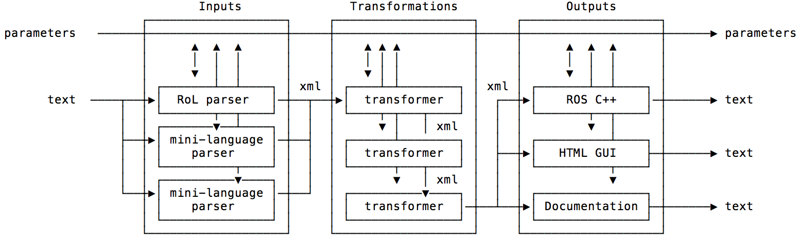

# The Robotics Language compiler philosophy

<!-- TOC START min:1 max:3 link:true update:true -->
- [The Robotics Language compiler philosophy](#the-robotics-language-compiler-philosophy)
  - [Definitions](#definitions)
  - [The parameters](#the-parameters)
    - [Viewing parameters in the command line](#viewing-parameters-in-the-command-line)
    - [Using and loading extra parameters](#using-and-loading-extra-parameters)
    - [Parameters in plug-ins](#parameters-in-plug-ins)
    - [Parameters structure](#parameters-structure)
  - [The code](#the-code)
    - [Viewing the code in the command line](#viewing-the-code-in-the-command-line)
    - [Code's tree evolution](#codes-tree-evolution)
    - [Base representation](#base-representation)
    - [Special tags](#special-tags)
    - [Special attributes](#special-attributes)
  - [The plug-in / modules](#the-plug-in--modules)
    - [Input modules](#input-modules)
    - [Transformer modules](#transformer-modules)
    - [Output modules](#output-modules)
  - [The abstract syntax tree language](#the-abstract-syntax-tree-language)
  - [Extra tools](#extra-tools)
    - [The RoL parser](#the-rol-parser)
    - [Code serialiser](#code-serialiser)
    - [Template engine](#template-engine)
    - [Command line parameters](#command-line-parameters)
    - [Multi-lingual messages](#multi-lingual-messages)
    - [Error handling](#error-handling)

<!-- TOC END -->




## Definitions

The `rol` compiler implements a generic engine that works by processing two types of information, **code** and **parameters**, through three steps: **input**, **transformations**, and **output**.


In this document we will use the words **input** or **parser** interchangeably, meaning the process of transforming text written in a particular language to an [abstract syntax tree](https://en.wikipedia.org/wiki/Abstract_syntax_tree) implemented in [xml](https://en.wikipedia.org/wiki/XML), i.e. the internal representation of the source code.

The words **output** and **code generation** mean the process of transforming the abstract syntax tree into text documents, such as, c++ code, HTML pages, etc.

The word **code** refers to the abstract syntax tree implemented in **xml**. The xml structure was chosen for its ability to store attributes on each tag. Attributes can be used by each module to store information for a particular element of the abstract syntax tree, acting as _an annotation_ that can be used for decision making or code generation.

The word **parameters** refer to generic information, independent of the code, used in all the processing steps of the compiler. Parameters change the behaviour of the processing functions.

The words **plug-in** or **modules** refer to processing blocks that operate on text (for input or output), code, or the parameters. The `rol` compiler is designed to be modular, composed of modules that are sequenced to process from inputs to outputs.

To summarise, the process is:
  1. Code (written in text) is parsed into the abstract syntax tree (represented in xml)
  2. Transformers annotate the abstract syntax tree
  3. The abstract syntax tree is output into various types of text formats.


## The parameters

Parameters are any piece of information that may be relevant for the parsing, transformation, and code generation parts of the compiler. Parameters change the behaviour of the processing functions. Parameters are represented internally by a python dictionary.

All parameters can be assigned to command line flags that are loaded when the compiler is called. Parameters can also be loaded via YAML files.

### Viewing parameters in the command line

Parameters can be printed in the terminal using the flag `--show-parameters` or `-p`:

```shell
rol --show-parameters
```

or in compressed form:

```shell
rol -p
```


The previous command will probably show too much information. To print only a subset of the parameters the flag `--show-parameters-path 'path'` or `-P 'path'` can be used. For example, to see only the `globals` section, one can type:

```shell
rol  --show-parameters-path 'globals'
```
or

```shell
rol -P 'globals'
```

which returns:

```python
{'compile': False,
 'compilerLanguage': 'en',
 'developer': False,
 'deploy': '/home/<user>/deploy',
 'language': 'en',
 'launch': False,
 'output': 'RosCpp',
 'removeCache': False,
 'verbose': 'none',
 ...
```

If you type `rol -h` you will be show the full help for the compiler. The section on `globals` appears as:

```
globals:
  -c, --compile         Compiles the output of all modules
  --compiler-language STR
                        Spoken language used by the compiler
  -d, --debug           Turn on debug features for all modules
  -p STR, --deploy-path STR
                        The path where the generated code is saved
  --language STR        Spoken language used for the robotics language file
  -l, --launch          Launches the output generated by all modules
  -o [STR [STR ...]], --output [STR [STR ...]]
                        Outputs
  --remove-cache        Deletes the compiler cache
  -v STR, --verbose STR
                        Shows verbose information for the compiler and its modules
```

For more information on creating custom messages for the command line see the section on [Command line options](#command-line-options).


Note that the flag `--show-parameters-path` uses the [dpath](https://github.com/akesterson/dpath-python) library. Please read the [dpath documentation]([dpath](https://github.com/akesterson/dpath-python)) for the available search options. For example, to get all the values for the key `name` in the `Information` domain one can write:

```shell
 rol --show-parameters-path 'Information/*/name'
 ```

 ### Compiler steps


The compiler follows a number of steps, represented by each individual plug-in (see figure above). You can view these steps by using the `-v` or `--verbose` flag:

 ```shell
 rol helloworld.rol -v debug
 ```

 As the compiler progresses the parameters might be updated by each plug-in. You can use the flag `--show-step` to show the state of the parameters for a particular step:

 ```shell
 rol helloworld.rol --show-parameters-path 'Transformers' --show-step 7
 ```
or

```shell
rol helloworld.rol -P 'Transformers' -s7
```

If the flag `--show-step` is not specified, then by default the step is 1.

If you are developing a new plug-in it may happen that the full process from parsing to code generation will not work. You can interrupt the compiler at a particular step by using the flag `--show-stop` in combination with `--show-step`:

 ```shell
 rol helloworld.rol --show-parameters-path 'Transformers' --show-step 2 --show-stop
 ```

### Using and loading extra parameters


Parameters can also be loaded using [YAML](https://en.wikipedia.org/wiki/YAML) files

```shell
rol helloworld.rol parameters.yaml
```

Many parameters can be loaded at once. Each dictionary extracted is merged with the built in parameters. Parameters may be overwritten in this process.

```shell
rol helloworld.rol parameters1.yaml parameters2.yaml parameters3.yaml
```

In addition, the `rol` compiler will look and load automatically for the files `~/.rol/parameters.yaml` and `rol.parmameters.yaml` residing in the same folder as the `.rol` file. The order of loading is the following:

order | parameters
--|--
1 | Defaults from `rol` and from all modules (can be cached)
2 | global file `~/.rol/parameters.yaml` loaded automatically
3 | local file `rol.parameters.yaml` residing in the same folder as `.rol`, loaded automatically
4 | list of yaml files passed as arguments
5 | command line parameters specified by flags

For example the `~/.rol/parameters.yaml` can contain information about your company and yourself, so that it is inserted into the code generated automatically:

```yaml
Information:
  user:
    name: Gabriel Lopes
    email: g.lopes@robotcaresystems.com
    web: http://www.dcsc.tudelft.nl/~glopes/publications.html
  company:
    name: Robot Care Systems B.V.
    address: Taco Scheltemastraat 5
    zipcode: 2509 JJ
    city: The Hague
    country: Netherlands
    email: info@robotcaresystems.com
    web: http://www.robotcaresystems.com
    telephone: +31 88 111 00 90
```

In the local `rol.parameters.yaml` you can include information about the license and copyright for that particular node:

```yaml
Information:
  software:
    name: SuperRobot
    version: 1.0.0
    description: The supervisory control engine for the robot
    maintainer:
      name: John
      email: john@some_company.com
    author:
      name: Gabriel Lopes
      email: g.lopes@robotcaresystems.com
    url: http://www.robotcaresystems.com
    license: Apache 2.0
    copyright: Robot Care Systems B.V., 2015-2018
    year: 2018
```

The c++ headers of the code generated using the RosCpp module read:

```c++
/*
 * Node name: hello world
 *
 * Generated on: 12 April, 2018
 *       Author: Gabriel Lopes
 *      Licence: Apache 2.0
 *    Copyright: Robot Care Systems B.V., 2015-2018
 *
 *    THIS FILE WAS AUTOMATICALLY GENERATED USING THE ROBOTICS LANGUAGE
 *
 */
```

The `package.xml` file reads:

```xml
<?xml version="1.0"?>
<package>
  <name>hello_world</name>
  <version>1.0.0</version>
  <description>The supervisory control engine for the robot</description>
  <maintainer email="john@some_company.com">John</maintainer>
  <license>Apache 2.0</license>
  <url type="website">http://www.robotcaresystems.com</url>
  <author email="g.lopes@robotcaresystems.com">Gabriel Lopes</author>

  <buildtool_depend>catkin</buildtool_depend>

  <build_depend>roscpp</build_depend>
  <build_depend>std_msgs</build_depend>

  <run_depend>roscpp</run_depend>
  <run_depend>std_msgs</run_depend>

</package>
```

### Parameters in plug-ins

Each plug-in can define parameters that are included automatically in the list of parameters with the domain name of the plug-in.

For example, the parameters defined in the file [RoboticsLanguage/Outputs/RosCpp/Parameters.py](../../../Outputs/RosCpp/Parameters.py):

```python
parameters = { 'strict':False,
               'globalIncludes':set(),
               'localIncludes':set()
               }
```

are included in the general parameters using the domain name `Outputs/RosCpp`:

```shell
rol helloworld.rol --show-parameters-path 'Outputs/RosCpp'
```

```python
{'globalIncludes': set([]), 'localIncludes': set([]), 'strict': False}
```

### Parameters structure

The parameters dictionary is organised according to the following list:

- `globals` These are the main generic parameters for the compiler. These include elements such as compiler language, list of outputs, verbosity, debugging, etc. The globals are defined in the file  [`RoboticsLanguage/Base/Parameters.py`](../../../Base/Parameters.py).

- `developer` Options for printing code and parameters, stoping compiler, etc. Definition in file [`RoboticsLanguage/Base/Parameters.py`](../../../Base/Parameters.py).

- `Information` Personal and company information that is embedded in the code generated. These parameters are usually stored in the files `~/.rol/parameters.yaml` and local `rol.parameters.yaml`. See [`RoboticsLanguage/Base/Parameters.py`](../../../Base/Parameters.py) for defaults.

- `Inputs` Parameters from the input modules. These parameters are cached.

- `Transformers` Parameters from the transformer modules. These parameters are cached.

- `Outputs` Parameters from the output modules. These parameters are cached.

- `manifesto` A structure with the names of each module.

- `language` A flat list describing the internal RoL language.

- `messages` A flat list containing all messages used by the `rol` compiler in different spoken languages.

- Other parameters used internally include `errorExceptions` and `errorHandling` for error handling, and `command_line_flags` for defining how parameters appear in the command line help.

## The code
Code is represented internally by an xml object. The xml tree structure evolves by including new annotations by each of the modules. The base RoL compiler also makes tree modifications to, e.g. include default values of functions, etc.


### Viewing the code in the command line

Just as in the case of the parameters, the internal xml code can also be printed to the terminal using the flag `--show-code` or `-x`:

```shell
rol helloworld.rol --show-code
```
or
```shell
rol helloworld.rol -x
```


To print only a subset of the code the flag `--show-code-path 'path'` can be used. For example, to see only all the string tags one can type:

```shell
rol helloworld.rol --show-code-path '//string'
```
or
```shell
rol helloworld.rol -X '//string'
```

The flag `--show-code-path` uses the [lxml](http://lxml.de) implementation of [XPath](https://en.wikipedia.org/wiki/XPath). As such, complex queries can performed. For example, to find all the function options called `initialise` one can use:

```shell
rol helloworld.rol --show-code-path '//option[@name="initialise"]'
```

### Code's tree evolution

Each module can add annotations (or in special cases tree modifications) to the code. Using the flag `--show-step` each phase of the evolution can be printed in the command line. It can be combined with `--show-stop`, as in the case for the parameters.

The first step is usually the direct output of the parser:


```shell
rol helloworld.rol --show-code --show-step 1
```
or
```shell
rol helloworld.rol -x -s1
```


```xml
<node p="64">
  <option p="26" name="name">
    <string p="26">hello world</string>
  </option>
  <option p="63" name="initialise">
    <print p="62">
      <string p="61">hello world!</string>
    </print>
  </option>
</node>
```


Note the attributes `p` represent the position of the tag on the original text source code. The `p` attribute is used for warning and error messages of the compiler. The special attribute `name` is used by a few special tags to simplify the xml structure.

The 2nd step is usually the output of the RoL preprocessor. It does semantic checking, fill in default function parameters, etc.


```shell
rol helloworld.rol --show-code --show-step 2
```

```xml
<node p="64" type="node">
  <option p="26" name="name" type="string">
    <string p="26" type="string">hello world</string>
  </option>
  <option p="63" name="initialise" type="none">
    <print p="62" type="none">
      <string p="61" type="string">hello world!</string>
      <option name="level" type="string">
        <string type="string">info</string>
      </option>
    </print>
  </option>
  <option name="definitions" type="none"/>
  <option name="rate" type="real">
    <real type="real">1</real>
  </option>
  <option name="finalise" type="none"/>
</node>
```

In the previous example the default parameters `definitions`, `rate`, and `finalise` for the tag `node` were introduced. The option `level` was introduced for the `print` tag. The semantic checker performed type checking and annotated the tags with the attribute `type`.

In between steps 3 to 6 the transformer modules annotate the xml code.

The final step will run the `serialise` function and annotate the code with snippets of the output text.

```shell
rol helloworld.rol --show-code --show-step 6
```

```xml
<node p="64" type="node">
  <option p="26" name="name" type="string" RosCpp="&quot;hello world&quot;">
    <string p="26" type="string" RosCpp="&quot;hello world&quot;">hello world</string>
  </option>
  <option p="63" name="initialise" type="none" RosCpp="ROS_INFO_STREAM(&quot;hello world!&quot;)">
    <print p="62" type="none" RosCpp="ROS_INFO_STREAM(&quot;hello world!&quot;)">
      <string p="61" type="string" RosCpp="&quot;hello world!&quot;">hello world!</string>
      <option name="level" type="string">
        <string type="string" RosCpp="&quot;info&quot;">info</string>
      </option>
    </print>
  </option>
  <option name="definitions" type="none" RosCpp=""/>
  <option name="rate" type="real" RosCpp="1">
    <real type="real" RosCpp="1">1</real>
  </option>
  <option name="finalise" type="none" RosCpp=""/>
</node>
```

In the previous example, since the output module is `RosCpp` the attribute `RosCpp` has been added to the code.


The general evolution of the code is the following:

step | process | new elements
--|--| --
1 | Parser  |   xml structure with `p` attributes specifying the position of the tag on the text source code. The attribute `name` is added to some special tags.
2  | Semantic checker  | Default function arguments are filled in, possibly introducing new tree elements. Type checking is performed introducing the attribute `type`.
3 | Modules  | Usually create own annotations to code  
4  | Code serialiser  | Create an attribute for each output with the same name. Insert snippets of serialised code on the attribute.
5  | Code generators  |  Normally at this point the code does not change anymore. Code is used by the template engine to create output text code.


### Base representation

The base representation of the abstract syntax tree consists of an xml structure with no attributes (except for the [special function](#special-tags))

```xml
<print>
  <string>hello world!</string>
</print>
```

The previous example is the output of the RoL code:

```coffeescript
print('hello world!')
```


### Special tags

Special tags are used with the attribute `name` to simplify the xml code tree. These tags include a variable, option, or function:

```xml
<variable name="x"/>
```

```xml
<option name="rate">
  ...
</option>
```

```xml
<function name="f">
  ...
</function>
```

### Special attributes

A design goal of the RoL abstract syntax tree is to use attribute free xml structures. Each module can then add its own attributes (annotations). However, in order so simplify the code structure two special attributes are used:

- `name` for naming variables, options, functions
- `p` for keeping track of the position of the tag in the original text source code. This is needed for error and warning messages


## The plug-in / modules

There are 3 type of modules: `Inputs`, `Transformers`, and `Outputs`. These are stored in the folders with the same name. Templates of new modules can be created using the `rol` compiler with the flags `-o Developer` and  `--create-input-template`, `--create-transformer-template` or `--create-output-template`.


### Input modules

You can use the templates provided to create a new input module:

```shell
rol -o Developer --create-input-template "My input"
```


Input modules must follow a file structure, listed below

```
RoboticsLanguage
│
└───Inputs
    │
    └───MyInput
        │   __init__.py
        │   ErrorHandling.py
        │   Language.py
        │   Manifesto.py
        │   Messages.py
        │   Parameters.py
        │   Parse.py
        │   README.md
```
- `Manifesto.py` contains the base information of the module. The `rol` compiler uses this file to detect and initialise this module. This file is **mandatory**. The content of the manifesto is a dictionary:

  ```python
  manifesto = {
    'packageName':'My input',
    'packageShortName':'MyInput',
    'fileFormat': 'mi',
    }
  ```

  1. The `packageName` should be a space separated list of words.

  2. The `packageShortName` should be a Camel case version of the module name. This should match with the folder name.

  3. The `fileFormat` instructs the `rol` compiler to open `.mi` files for parsing using this module.


- `Parse.py` is the main parsing file. It should contain a function

  ```coffeescript
  parse(text, parameters) -> (code, parameters)
  ```
   that takes as input text and the dictionary of parameters, and return an `lxml.etree` object, plus updated parameters:

  ```python
  from lxml import etree

  def parse(text, parameters):

    # Place your parser here. Must return an lxml.etree object
    code = ...

    return code , parameters
  ```

  This `parse` function is called automatically by the compiler ([`RoboticsLanguage/Base/Inputs.py`](../../../Base/Inputs.py)) when needed. This function can also be called when used as a mini-language. For example, the [`xmlMiniLanguage`](../../../Base/Utilities.py#L504) function can be used by your parser to call other parsers for mini-languages. This file is **mandatory**.

- `Parameters.py` lists the parameters for this package:

  ```python
  parameters = {}

  command_line_flags = {}
  ```

  For more information on the `command_line_flags` structure see section [Command Line Flags](#command_line_flags). This file is optional.

- `Messages.py` list possible messages in different spoken languages. This file is optional.

  ```python
  messages = {}
  ```

- `Language.py` adds new keywords to the abstract syntax tree language definition. For more information see section [The abstract syntax tree language](#the-abstract-syntax-tree-language). This file is optional.

  ```python
  language = {}
  ```

- `ErrorHandling.py` allows adding new error handling functions. For more information see [Error handling](#error-handling). This file is optional.


### Transformer modules


You can use the templates provided to create a new transformer module:

```shell
rol -o Developer --create-transformer-template "My transformer"
```


Transformer modules must follow a file structure, listed below

```
RoboticsLanguage
│
└───Transformers
    │
    └───MyTransformer
        │   __init__.py
        │   ErrorHandling.py
        │   Language.py
        │   Manifesto.py
        │   Messages.py
        │   Parameters.py
        │   Transform.py
        │   README.md
        └───Templates
            └───Outputs
```
- `Manifesto.py` contains the base information of the module. The `rol` compiler uses this file to detect and initialise this module. This file is **mandatory**. The content of the manifesto is a dictionary:

  ```python
  manifesto = {
    'packageName':'My transformer',
    'packageShortName':'MyTransformer',
    'order':0
    }
  ```

  1. The `packageName` should be a space separated list of words.

  2. The `packageShortName` should be a Camel case version of the module name. This should match with the folder name.

  3. The `order` sets the order in which modules are sequenced in the process.


- `Transform.py` is the main transformation file. It should contain a function

  ```coffeescript
  transform(code, parameters) -> (code, parameters)
  ```
   that takes as input code as an `lxml.etree` object and the dictionary of parameters, and returns updated code and parameters.

  ```python
  from lxml import etree

  def transform(code, parameters):

    # place here your transformation code

    return code, parameters
  ```

  This `transform` function is **always** called by the compiler ([`RoboticsLanguage/Base/Transformations.py`](../../../Base/Transformations.py)) in the specified order. This file is **mandatory**.

- The files `Parameters.py`, `Messages.py`, `Language.py`, `ErrorHandling.py` are the same as in section [Input modules](#input-modules) and are optional.


### Output modules


You can use the templates provided to create a new output module:

```shell
rol -o Developer --create-output-template "My output"
```


Output modules must follow a file structure, listed below

```
RoboticsLanguage
│
└───Outputs
    │
    └───MyOutput
        │   __init__.py
        │   ErrorHandling.py
        │   Language.py
        │   Manifesto.py
        │   Messages.py
        │   Parameters.py
        │   Output.py
        │   README.md
```
- `Manifesto.py` contains the base information of the module. The `rol` compiler uses this file to detect and initialise this module. This file is **mandatory**. The content of the manifesto is a dictionary:

  ```python
  manifesto = {
    'packageName':'My output',
    'packageShortName':'MyOutput',
    }
  ```

  1. The `packageName` should be a space separated list of words.

  2. The `packageShortName` should be a Camel case version of the module name. This should match with the folder name.


- `Output.py` is the main output file. It should contain a function

  ```coffeescript
  output(code, parameters) -> nothing
  ```
   that takes as input code as an `lxml.etree` object and the dictionary of parameters, and does not return anything.

  ```python
  from lxml import etree

  def output(code, parameters):

    # place here your output code

    return
  ```

  This `output` function is called by the compiler ([`RoboticsLanguage/Base/Outputs.py`](../../../Base/Outputs.py)) if the this output is set with the flag `-o`. This file is **mandatory**.

- The files `Parameters.py`, `Messages.py`, `Language.py`, `ErrorHandling.py` are the same as in section [Input modules](#input-modules) and are optional.


## The abstract syntax tree language


## Extra tools

### The RoL parser

### Code serialiser

### Template engine

### Command line parameters

### Multi-lingual messages

### Error handling
