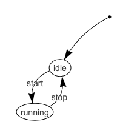

# Finite State Machines tutorial - 1. Defining a language and creating a parser


## Defining a language
The first step is to create a language that can represent the finite state machine object. Ideally such a language should be as simple to interpret as possible. Normally, finite state machines are represented graphically:



In this example there exist two states "idle" and "running", together with two transitions "start" and "stop". The initial state is "idle", represented by the state with an incoming arc from the dot.

A first attempt at defining a language can be for example:

```
(idle)-start->(running)
```

This represents two states with the notation `(state)` connected by a transition `-transition->`.

The complete machine illustrated above is then
```
(idle)-start->(running)
(running)-stop->(idle)
```
In addition to this information one needs to define the initial state and give a name to the finite state machine. An example language can be:

```
name:myMachine
initial:idle

(idle)-start->(running)
(running)-stop->(idle)
```
This information is be sufficient to create the code that generates and runs a finite state machine.

## Parsing the language

To parse the language defined above we use the [Python library Parsley](https://github.com/pyga/parsley). For in-depth information on designing grammars for languages please see the [parsley tutorials](https://parsley.readthedocs.io/en/latest/).

### Creating a RoL input plugin

We start by creating an input plugin for RoL where the parsing will happen. To achieve that we can use `rol` in command line to generate a template:

```bash
rol --create-input-template "My Finite State Machine" -o Developer
```

`rol` should return the message `Created Inputs plugin "MyFiniteStateMachine" in folder ~/.rol/plugins/Inputs/MyFiniteStateMachine`.

You can now open the folder `~/.rol/plugins/Inputs/MyFiniteStateMachine` with your favourite editor to see its structure:

```
.
├── Documentation
│   ├── README.md
│   ├── Reference.md
│   └── Tutorials.md
├── ErrorHandling.py
├── Examples
│   └── MyFiniteStateMachine.rol
├── Language.py
├── Manifesto.py
├── Messages.py
├── Parameters.py
├── Parse.py
├── README.md
├── Tests
│   └── test_MyFiniteStateMachine.py
└── __init__.py
```
Open the file `Parse.py` and you will notice that there is already a language defined. We will modify this language to fit our needs. You can compile the example by typing:

```bash
rol ~/.rol/plugins/Inputs/MyFiniteStateMachine/Examples/MyFiniteStateMachine.rol --remove-cache -c
```

The flag `--remove-cache` is important to make `rol` find the new package. You can also type

```bash
rol --info --remove-cache
```

To make sure your package is installed:

```
The Robotics Language version: 0.2
Inputs:
  MyFiniteStateMachine (0.0.0) *
  ...
```


### The grammar

The Input plugin template defines the following grammar in the file `Parser.py`:

```python
grammar_definition = """
word = <letter+>

name = ws 'word' ws ':' ws word:w ws -> xml('word', text=w)
"""
```

The text `word = <letter+>` defines a rule that states that `word` is a concatenation of 1 or more letters.

The text `name = ws 'word' ws ':' ws word:w ws -> xml('word', text=w)` represents a more complicated rule:

 - `ws` means white space.
 - `word:w` means that the matched word is saved in the variable `w`.
 - `->` represents that action: an XML block is returned with the tag `word` and the inside text is the content of the variable `w`.
For example the text `name: hello` matches the rule, and the result is `<word>hello</word>`

Make sure to look at the [parsley tutorials](https://parsley.readthedocs.io/en/latest/).


We can modify the grammar to include the definition of the machine name and the initial state, i.e. `name:word` and `initial:word`:
```python
grammar_definition = """
word = <letter+>

name = 'name' ws ':' ws word:name -> xml('name',name)

initial = 'initial' ws ':' ws word:state -> xml('initial',state)
"""
```

Next we create the grammar for `(state)-transition->(state)`:


```
state = '(' ws word:state ws ')' -> xml('state', text=state)

transition = state:begin ws '-' ws word:transition ws '->' state:end -> xml('transition', [begin, end], {'name':transition})
```

Finally, we allow for many transitions:

```python

grammar_definition = """
word = <letter+>

name = 'name' ws ':' ws word:name -> xml('name',text=name)

initial = 'initial' ws ':' ws word:state -> xml('initial', text=state)

state = '(' ws word:state ws ')' -> xml('state', text=state)

transition = state:begin ws '-' ws word:transition ws '->' state:end -> xml('transition', [begin, end], {'name':transition})

machine = ws name:n ws initial:i (ws transition)*:t ws -> xml('machine',[n, i] + t)
"""
```

We change the parsing line to look for the `machine` rule:

```python
# parse the text
code = grammar(text).machine()
```

We are now ready to test the parser. To do this create a file called `test.mfsm` and add the following text:

```
  name: test
  initial: idle

  (idle)-start->(running)
  (running)-stop->(idle)
```

Since we created an input plugin, the `rol` now opens files with the extension equal to the initials of the package name. Run:

```bash
rol test.mfsm --show-code --show-stop
```
Note that `--show-code` shows the abstract syntax tree in XML, and `--show-stop` will stop the compiler from continuing after the parsing step. This is useful to debug the parser before code is generated.


We get the result:

```xml
<mfsm:machine xmlns:mfsm="mfsm">
  <mfsm:name>test</mfsm:name>
  <mfsm:initial>idle</mfsm:initial>
  <mfsm:transition name="start">
    <mfsm:state>idle</mfsm:state>
    <mfsm:state>running</mfsm:state>
  </mfsm:transition>
  <mfsm:transition name="stop">
    <mfsm:state>running</mfsm:state>
    <mfsm:state>idle</mfsm:state>
  </mfsm:transition>
</mfsm:machine>
```

Note that a namespace `mfsm` is added to every tag used on this mini-language. This allows you to safely use any tag names without interfering with the built-in tags already defined.

### New keywords for the abstract syntax tree


The final step in this tutorial is defining the language keywords so that the compiler knows what to do with the new tags we have created. For this, edit the file `Language.py`, and replace the language dictionary by:

```python
language = {
  '{mfsm}machine':    { 'definition': { arguments: arguments('anything'), returns: returns('nothing')}},
  '{mfsm}name':       { 'definition': { arguments: arguments('anything'), returns: returns('nothing')}},
  '{mfsm}initial':    { 'definition': { arguments: arguments('anything'), returns: returns('nothing')}},
  '{mfsm}state':      { 'definition': { arguments: arguments('anything'), returns: returns('nothing')}},
  '{mfsm}transition': { 'definition': { arguments: arguments('anything'), returns: returns('nothing')}},
}
```

For now we simplify by saying that the tag (functions in the abstract syntax tree) accept any argument and return nothing. Later these definitions can be modified so that the type checker can catch any semantic errors.


We are ready to include the new language as a mini language on a `.rol` file. Create and edit the file `test.rol`:

```coffeescript
node(
	name:'my finite state machine',

	definitions: MyFiniteStateMachine<{

		  name: test
		  initial: idle

		  (idle)-start->(running)

		  (running)-stop->(idle)

	}>
)
```

Run

```bash
rol test.rol --show-code --compile
```

It should compile fine, and will display the abstract syntax tree:

```xml
<node p="174">
  <option p="37" name="name">
    <string p="37">my finite state machine</string>
  </option>
  <option p="173" name="definitions">
    <mfsm:machine xmlns:mfsm="mfsm">
      <mfsm:name>test</mfsm:name>
      <mfsm:initial>idle</mfsm:initial>
      <mfsm:transition name="start">
        <mfsm:state>idle</mfsm:state>
        <mfsm:state>running</mfsm:state>
      </mfsm:transition>
      <mfsm:transition name="stop">
        <mfsm:state>running</mfsm:state>
        <mfsm:state>idle</mfsm:state>
      </mfsm:transition>
    </mfsm:machine>
  </option>
</node>
```

### Simpler language

Now suppose we want to simplify the language by allowing many sequences of states and transitions, e.g.:

```
(idle)-start->(running)-stop->(idle)
```

To achieve this we need to modify the grammar rule for a transitions:


```
transition = state:begin ws '-' ws word:label ws '->' ws ( transition:t -> [ xml('transition', [begin, copy(t[0].getchildren()[0])], {'name':label})] + t
                                                         | state:end -> [ xml('transition', [begin, end], {'name':label}) ]
                                                         )
```

- This rule means that after the arrow `->` it will look first for another transition. Otherwise it looks for a state.
- If the element after `->` is a transition then it will create arc from  `begin` to the first state of the first forward transition, i.e. `t[0].getchildren()[0]` (with meaning: get the first child of the first transition). Note that a "deepcopy" is needed, since we are reusing an element in `lxml`. The resulting transition is prepended to the list of forward transitions.
- If the element is a state, then return the transition as a list with one xml element.
- The rule `transition` now returns a list of transitions

Additionally we need to adapt the definition of machine to merge a "list of lists" of transitions:

```
machine = ws name:n ws initial:i (ws transition)*:t ws -> xml('machine',[n, i] + [item for sublist in t for item in sublist])
```

The new complete grammar is:

```python
grammar_definition = """
word = <letter+>

name = 'name' ws ':' ws word:name -> xml('name',text=name)

initial = 'initial' ws ':' ws word:state -> xml('initial', text=state)

state = '(' ws word:state ws ')' -> xml('state', text=state)

transition = state:begin ws '-' ws word:label ws '->' ws ( transition:t -> [ xml('transition', [begin, copy(t[0].getchildren()[0])], {'name':label})] + t
                                                         | state:end -> [ xml('transition', [begin, end], {'name':label}) ]
                                                         )

machine = ws name:n ws initial:i (ws transition)*:t ws -> xml('machine',[n, i] + [item for sublist in t for item in sublist])
"""
```

We are ready to test the new grammar. Update the file `test.rol` to read:

```coffeescript
node(
	name:'my finite state machine',

	definitions: MyFiniteStateMachine<{

		  name: test
		  initial: idle

		  (idle)-start->(running)-stop->(idle)

	}>
)
```

Run

```bash
rol test.rol --show-code --compile
```

It should compile fine, and will display the same abstract syntax tree as previously:

```xml
<node p="159">
  <option p="37" name="name">
    <string p="37">my finite state machine</string>
  </option>
  <option p="158" name="definitions">
    <mfsm:machine xmlns:mfsm="mfsm">
      <mfsm:name>test</mfsm:name>
      <mfsm:initial>idle</mfsm:initial>
      <mfsm:transition name="start">
        <mfsm:state>idle</mfsm:state>
        <mfsm:state>running</mfsm:state>
      </mfsm:transition>
      <mfsm:transition name="stop">
        <mfsm:state>running</mfsm:state>
        <mfsm:state>idle</mfsm:state>
      </mfsm:transition>
    </mfsm:machine>
  </option>
</node>
```


### Discussion

It is usually up to the user to decide on how the abstract syntax tree looks like. For example an alternative representation could add information into attributes instead of the text element, e.g.:

```xml
<mfsm:machine xmlns:mfsm="mfsm" name="test" initial="idle">
  <mfsm:transition name="start">
    <mfsm:state name="idle"/>
    <mfsm:state name="running"/>
  </mfsm:transition>
  <mfsm:transition name="stop">
    <mfsm:state name="running"/>
    <mfsm:state name="idle"/>
  </mfsm:transition>
</mfsm:machine>
```

or even more compactly

```xml
<mfsm:machine xmlns:mfsm="mfsm" name="test" initial="idle">
  <mfsm:transition name="start" begin="idle" end="running"/>
  <mfsm:transition name="stop" begin="running" end="idle"/>
</mfsm:machine>
```

The more compact the representation the more rigid it might become. For example in the last example, since there exist no `state` tags, one cannot add attributes to the states. In addition, when searching with `xpath`, different approaches must be used depending on the representation. Suppose we aim to compile a list of all the states in a machine.
- For the example used in the tutorial the `xpath` expression is:

  ```
  //mfsm:state/text()
  ```


- For the 2nd example representation the `xpath` expression is:

  ```
  //mfsm:state/@name
  ```


- For the 3rd example (most compact) representation the `xpath` expression becomes more complicated:

  ```
  //mfsm:transition/@begin|//mfsm:transition/@end
  ```

  or

  ```
  //mfsm:transition/@*[name()="begin" or name()="end"]
  ```

There exists a tradeoff between compactness and complexity. It is up to the developer to decide what is better suited for each problem.
