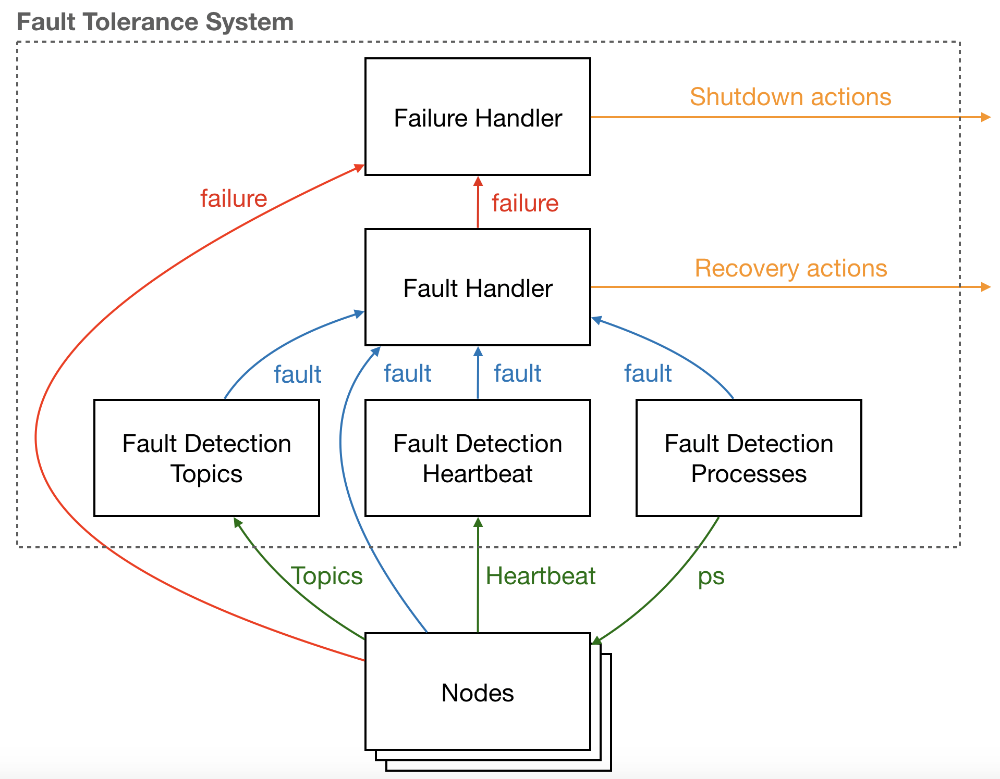

# Fault Tolerance system Documentation




The Fault Tolerance system consists of a collection of nodes that deal with faults and failures:

 - **Fault** is defined as an abnormal condition or defect at the component, equipment, or sub-system level which may lead to a failure.

 - **Failure**  is the state or condition from where it is not possible for a system to continue to function. Failures lead to system shutdown.

This implementation includes the following classes of nodes:

- [**Fault Detection Topics**](../../FaultDetectionTopics/Documentation/README.md) - Monitors content of topics and issues faults.

- [**Fault Detection Heartbeat**](../../FaultDetectionHeartbeat/Documentation/README.md) - Monitors if nodes are operating by measuring a heartbeat topic.

- [**Fault Detection Processes**](../../FaultDetectionProcesses/Documentation/README.md) - Monitors if nodes are operating by using operative system level tools, such as `ps`.

- [**Fault Handler**](../../FaultHandler/Documentation/README.md) - Acts on faults by generating recovery actions or by escalating into failures.

- [**Failure Handler**](../../FailureHandler/Documentation/README.md) - Acts on failures by generating shutdown actions.

## Message types
The fault and failure topic types have the following ros message definition:

```
string code
string cause
string description
time time
```

## Compiling and running

To use this node first create a file with the extension `.fts` using the `yaml` notation:

```yaml
# name of the fault tolerance system node
name: example_fault_tolerance_system

# names of the nodes
fault_detection_topics: example_fault_detection_topics
fault_detection_heartbeat: example_fault_detection_heartbeat
fault_detection_processes: example_fault_detection_processes
fault_handler: example_fault_handler
failure_handler: example_failure_handler
```

Running the following shell command will create a ros node that launches all the detection and handler nodes:

```shell
rol FaultToleranceSystems.fts --compile
```

To test you can use:

```shell
rol FaultToleranceSystems.fts --launch
```


For deployment in the robot you should use the resulting launch file, e.g.:

```shell
roslaunch example_fault_tolerance_system example_fault_tolerance_system.launch
```
